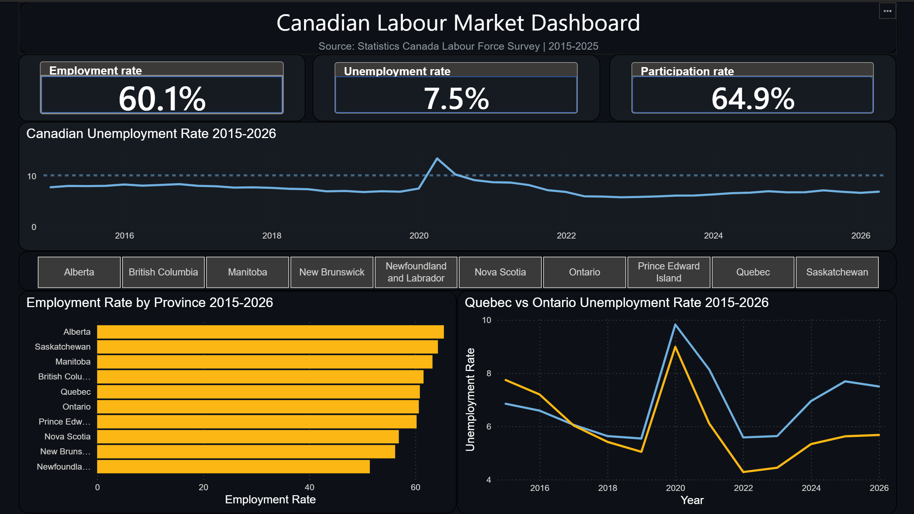

# 🇨🇦 Canadian Labour Market Dashboard

An end-to-end data pipeline and interactive Power BI dashboard analyzing Canadian employment trends from 2015 to 2026, built using real Statistics Canada data.



---

## 📊 Project Overview

This project demonstrates a complete BI workflow — from raw government data to a polished, interactive dashboard. The data tells the story of Canada's labour market across a decade, including the COVID-19 crash, recovery, and current trends by province.

**Key Insights Uncovered:**
- COVID-19 caused a 45% spike in unemployment in 2020 (7.0% → 10.2%)
- Quebec's labour market has consistently outperformed Ontario every year since 2022 — a reversal of the historical trend
- Alberta leads all provinces in employment rate (64%+), while Newfoundland and Labrador trails at ~51%
- Canada's unemployment rate has been gradually rising since its post-COVID low of 6.1% in 2023

---

## 🛠️ Tech Stack

| Tool | Purpose |
|------|---------|
| Python (pandas) | Data cleaning and transformation |
| PostgreSQL | Local data warehouse |
| psycopg2 | Python to PostgreSQL connection |
| Power BI Desktop | Interactive dashboard and DAX measures |
| Statistics Canada | Data source (Table 14-10-0287-01) |

---

## 📁 Project Structure

```
canadian-labour-market-dashboard/
│
├── data/
│   └── 14100287_cleaned.csv       # Cleaned dataset (4,080 rows)
│
├── scripts/
│   ├── clean.py                   # Data cleaning pipeline
│   ├── load_to_db.py              # Load data into PostgreSQL
│   ├── verify_db.py               # Verify database load
│   └── analysis.py                # SQL analytical queries
│
├── dashboard/
│   └── canadian_labour_market.pbix  # Power BI dashboard file
│
└── README.md
```

---

## 🔄 Pipeline Walkthrough

### Step 1 — Data Source
Downloaded the Labour Force Survey (Table 14-10-0287-01) from Statistics Canada — 5.4 million rows of monthly employment data going back to 1976.

### Step 2 — Data Cleaning (`clean.py`)
Applied the following filters to isolate meaningful data:
- Date: 2015 onwards
- Gender: Total (all genders)
- Age group: 15 years and over
- Data type: Seasonally adjusted
- Statistics: Estimate only (removed standard errors and confidence intervals)
- Metrics: Unemployment rate, Employment rate, Participation rate
- Geography: 10 Canadian provinces (excluded territories and national totals)

**Result:** 5.4M rows → 4,080 clean rows, zero duplicates

### Step 3 — Database Load (`load_to_db.py`)
Loaded the cleaned dataset into a local PostgreSQL database using psycopg2. Created a structured `employment_data` table with proper data types.

### Step 4 — Analysis (`analysis.py`)
Ran analytical SQL queries to surface key insights before building the dashboard:
- Year-over-year unemployment averages (COVID impact)
- Province rankings by employment rate
- Quebec vs Ontario head-to-head unemployment trend

### Step 5 — Dashboard (Power BI)
Built an interactive dashboard with:
- 3 KPI cards (Employment, Unemployment, Participation rates) using DAX measures
- COVID impact timeline (2015–2026)
- Province employment rate ranking (horizontal bar chart)
- Quebec vs Ontario unemployment comparison (dual-line chart)
- Interactive province slicer — filters all visuals simultaneously

---

## 📈 Dashboard Features

- **Dark professional theme** for clear data visibility
- **Interactive slicer** — click any province to filter all charts
- **DAX measures** for accurate percentage formatting
- **COVID reference line** marking the 10.2% peak in 2020
- **Seasonally adjusted data** for accurate trend analysis

---

## 🚀 How to Run This Project

### Prerequisites
- Python 3.x
- PostgreSQL installed locally
- Power BI Desktop (free)

### Setup

1. Clone the repo:
```bash
git clone https://github.com/yourusername/canadian-labour-market-dashboard
cd canadian-labour-market-dashboard
```

2. Create a virtual environment and install dependencies:
```bash
python -m venv venv
venv\Scripts\activate        # Windows
pip install pandas psycopg2-binary
```

3. Download the raw data from Statistics Canada:
   - Go to: https://www150.statcan.gc.ca/t1/tbl1/en/dtbl!14-10-0287-01
   - Download entire table as CSV
   - Place in the `data/` folder

4. Run the pipeline:
```bash
py scripts/clean.py
py scripts/load_to_db.py
py scripts/verify_db.py
```

5. Open `dashboard/canadian_labour_market.pbix` in Power BI Desktop

---

## 📋 Data Source

**Statistics Canada — Labour Force Survey**
- Table: 14-10-0287-01
- Frequency: Monthly (seasonally adjusted)
- Coverage: All Canadian provinces

Data is publicly available under the Statistics Canada Open Licence.

---

## 👤 Author

Built as a portfolio project demonstrating end-to-end BI skills — data extraction, cleaning, warehousing, and visualization using Canadian open government data.
